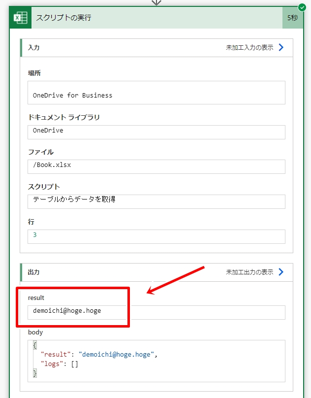

# フローからスクリプトにデータを渡す方法とスクリプトからデータを返す方法

- [スクリプトにデータを渡す方法](#スクリプトにデータを渡す方法)
- [スクリプトからデータを返す方法](#スクリプトからデータを返す方法)
- [参考資料](#参考資料)

---

## スクリプトにデータを渡す方法

処理対象となる新規Excelファイルと実行する下記スクリプト(テーブルに行追加)を作成します。  
下記スクリプトは「**サンプルシート**」上にある「**サンプルテーブル**」に、引数としてフローから渡されたデータを追加するスクリプトです。  

```typescript:テーブルに行追加.ts
function main(workbook: ExcelScript.Workbook, 氏名: string, 年齢: number, メールアドレス: string) {
  let sheet = workbook.getWorksheet("サンプルシート");
  if (!sheet) sheet = setUpSample(workbook);
  const table = sheet.getTable("サンプルテーブル");
  table.addRow(-1, [氏名, 年齢, メールアドレス]);
}

function setUpSample(workbook: ExcelScript.Workbook): ExcelScript.Worksheet {
  const sheet = workbook.addWorksheet("サンプルシート");
  const range = sheet.getRange("A1:C1");
  range.setValues([["氏名", "年齢", "メールアドレス"]]);
  sheet.addTable(range, true).setName("サンプルテーブル");
  range.getFormat().autofitColumns();
  return sheet;
}
```

新規フローを作成し(インスタント フロー、手動トリガー)、「スクリプトの実行」アクションで上記スクリプトを指定すると、スクリプトの引数がパラメーターとして指定できるようになっていることが確認できます。  


フローを実行すると、指定したデータがテーブルに追加されていることが確認できます。  


パラメーターを変えて何回かフローを実行し、その度に行が追加されることを確認してみましょう。  


スクリプトの引数の型を指定しないとどうなるかを確認してみましょう。  
(「年齢」の型指定を外す)  

```typescript:テーブルに行追加.ts
function main(workbook: ExcelScript.Workbook, 氏名: string, 年齢, メールアドレス: string) {
  let sheet = workbook.getWorksheet("サンプルシート");
  if (!sheet) sheet = setUpSample(workbook);
  const table = sheet.getTable("サンプルテーブル");
  table.addRow(-1, [氏名, 年齢, メールアドレス]);
}

function setUpSample(workbook: ExcelScript.Workbook): ExcelScript.Worksheet {
  const sheet = workbook.addWorksheet("サンプルシート");
  const range = sheet.getRange("A1:C1");
  range.setValues([["氏名", "年齢", "メールアドレス"]]);
  sheet.addTable(range, true).setName("サンプルテーブル");
  range.getFormat().autofitColumns();
  return sheet;
}
```


スクリプトの引数を省略可能にするとどうなるかを確認してみましょう。  
(「メールアドレス」をオプション引数とする)  

```typescript:テーブルに行追加.ts
function main(workbook: ExcelScript.Workbook, 氏名: string, 年齢: number, メールアドレス?: string) {
  let sheet = workbook.getWorksheet("サンプルシート");
  if (!sheet) sheet = setUpSample(workbook);
  const table = sheet.getTable("サンプルテーブル");
  table.addRow(-1, [氏名, 年齢, メールアドレス]);
}

function setUpSample(workbook: ExcelScript.Workbook): ExcelScript.Worksheet {
  const sheet = workbook.addWorksheet("サンプルシート");
  const range = sheet.getRange("A1:C1");
  range.setValues([["氏名", "年齢", "メールアドレス"]]);
  sheet.addTable(range, true).setName("サンプルテーブル");
  range.getFormat().autofitColumns();
  return sheet;
}
```


## スクリプトからデータを返す方法

上記と同じファイルを対象に今度はスクリプトからフローにデータを返してみます。  
下記スクリプト(テーブルからデータを取得)を作成し、フローから実行します。  

```typescript:テーブルからデータを取得.ts
//指定した行のメールアドレスを取得
function main(workbook: ExcelScript.Workbook, 行: number): string {
  const table = workbook.getTable("サンプルテーブル");
  return String(table.getColumnByName("メールアドレス").getRangeBetweenHeaderAndTotal().getRow(--行).getValue());
}
```


「result」として指定した行のメールアドレスが返ってきていることが確認できます。  



### オブジェクトで返す

下記のように複数の値をオブジェクトとして返すことができます。  

```typescript:テーブルからデータを取得.ts
function main(workbook: ExcelScript.Workbook, 行: number): {氏名: string, 年齢: number, メールアドレス: string} {
  const table = workbook.getTable("サンプルテーブル");
  const range = table.getRangeBetweenHeaderAndTotal().getRow(--行);
  return {
    氏名: String(range.getValues()[0][0]),
    年齢: Number(range.getValues()[0][1]),
    メールアドレス: String(range.getValues()[0][2])
  }
}
```


下記のようにinterfaceやtypeとして返すこともできます。  

```typescript:テーブルからデータを取得.ts
function main(workbook: ExcelScript.Workbook, 行: number): Employee {
  const table = workbook.getTable("サンプルテーブル");
  const range = table.getRangeBetweenHeaderAndTotal().getRow(--行);
  const res: Employee = {
    氏名: String(range.getValues()[0][0]),
    年齢: Number(range.getValues()[0][1]),
    メールアドレス: String(range.getValues()[0][2])
  };
  return res;
}

interface Employee {
  氏名: string;
  年齢: number;
  メールアドレス: string;
}
```

```typescript:テーブルからデータを取得.ts
function main(workbook: ExcelScript.Workbook, 行: number): Employee {
  const table = workbook.getTable("サンプルテーブル");
  const range = table.getRangeBetweenHeaderAndTotal().getRow(--行);
  const res: Employee = {
    氏名: String(range.getValues()[0][0]),
    年齢: Number(range.getValues()[0][1]),
    メールアドレス: String(range.getValues()[0][2])
  };
  return res;
}

type Employee = {
  氏名: string;
  年齢: number;
  メールアドレス: string;
};
```

## 参考資料

- [Power Automate を使用した Office スクリプトの実行 | Microsoft Docs](https://docs.microsoft.com/ja-jp/office/dev/scripts/develop/power-automate-integration?WT.mc_id=M365-MVP-4029057)