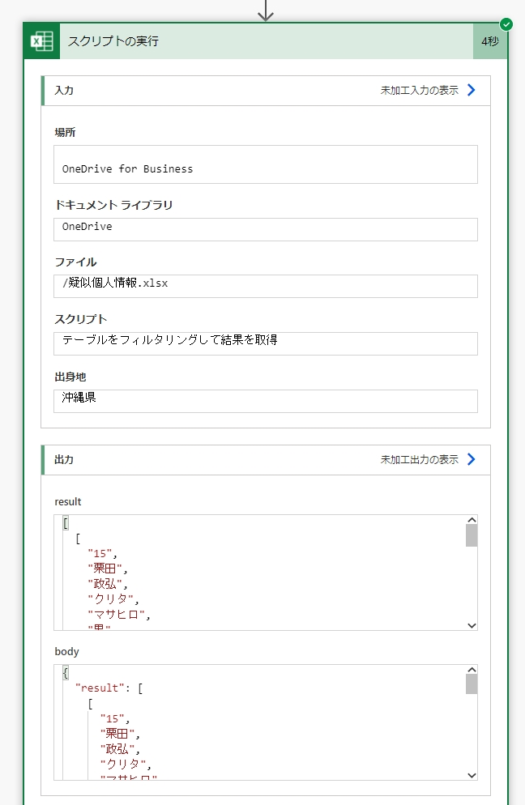

# フローからテーブルをフィルタリングして結果を取得する方法

下図のようなテストデータ([疑似個人情報.xlsx](files/疑似個人情報.xlsx))を準備し、実行するスクリプト(テーブルをフィルタリングして結果を取得)を作成します。  


下記スクリプトは「出身地」を指定してテーブルでフィルター処理を行い、結果を取得するスクリプトです。  

```typescript:テーブルをフィルタリングして結果を取得.ts
function main(workbook: ExcelScript.Workbook, 出身地: string): string[][] {
  const sheet = workbook.getWorksheet("personal_infomation");
  const table = sheet.getTable("個人情報テーブル");
  const column = table.getColumnByName("出身地");
  column.getFilter().applyCustomFilter("=*" + 出身地 + "*");
  const res = table.getRangeBetweenHeaderAndTotal().getVisibleView().getValues() as string[][];
  column.getFilter().clear();
  return res;
}
```

「スクリプトの実行」アクションで上記スクリプトを実行すると、下図のように指定した値でフィルタリングした結果を取得できることが確認できます。  





## 参考資料

- [テーブルをフィルター処理し、可視範囲を取得する | Microsoft Docs](https://docs.microsoft.com/ja-jp/office/dev/scripts/resources/samples/filter-table-get-visible-range?WT.mc_id=M365-MVP-4029057)