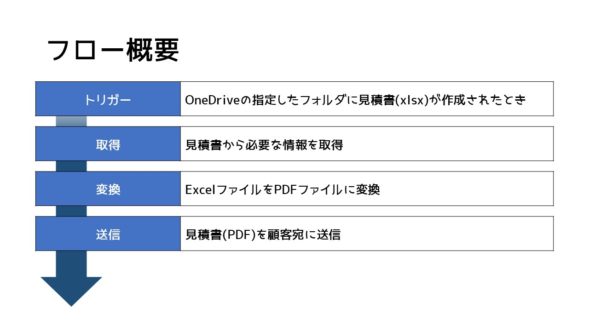
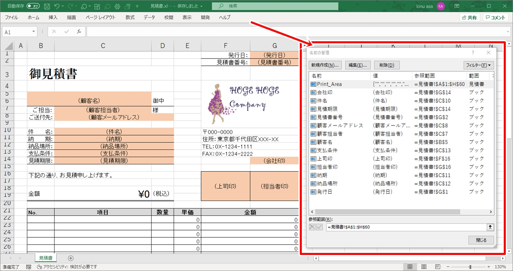
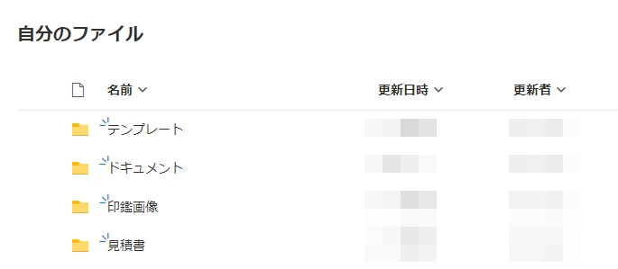
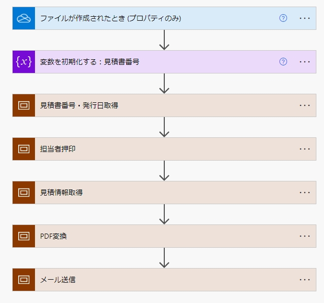
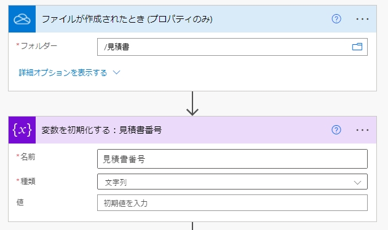
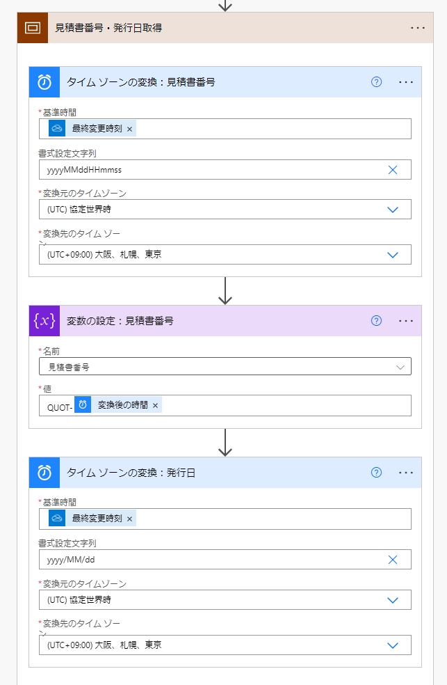
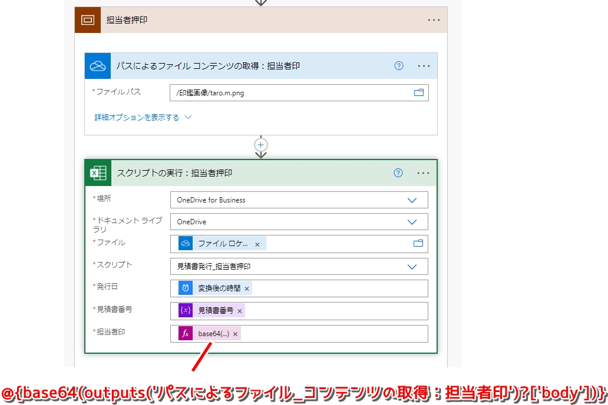
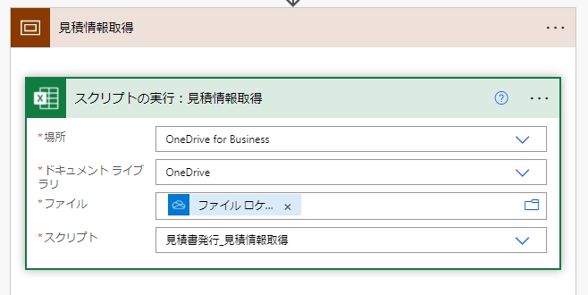
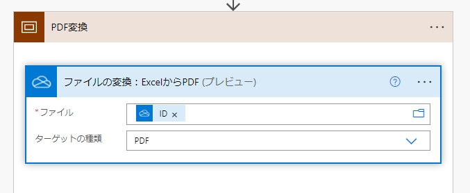
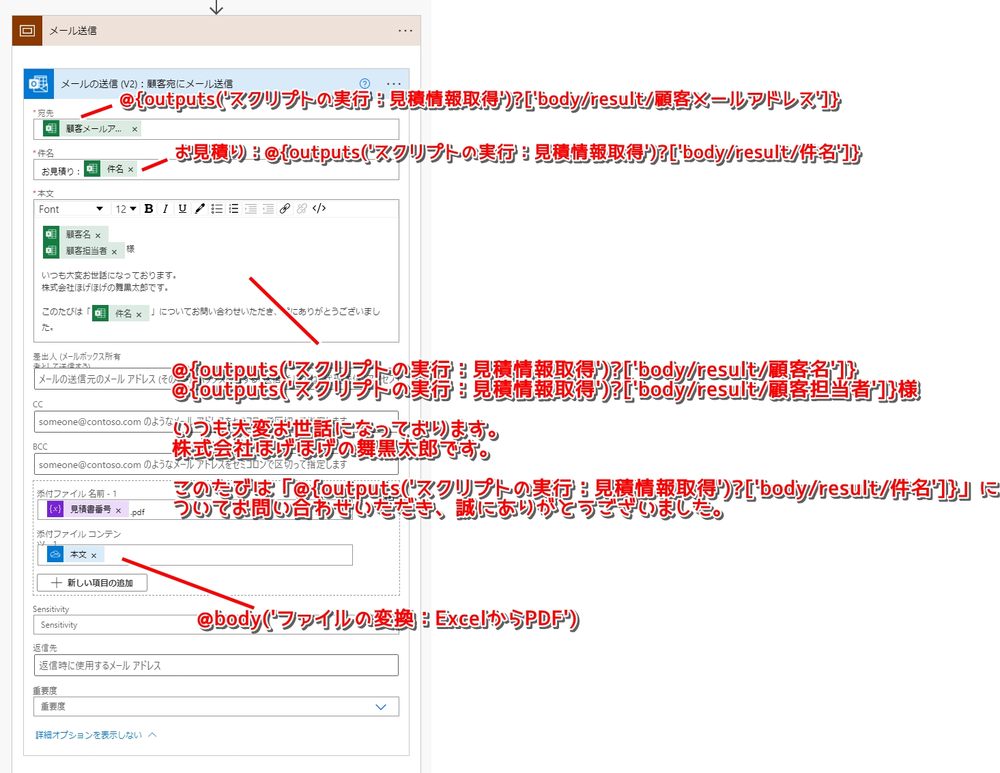

# Office スクリプトとPower Automateで見積書を発行する

- [フロー概要](#フロー概要)
- [見積書テンプレート](#見積書テンプレート)
- [使用するフォルダの構成](#使用するフォルダの構成)
- [フロー説明](#フロー説明)
- [関連資料](#関連資料)

---

Power AutomateにはOffice スクリプトのスクリプトを実行するためのコネクタ([スクリプトの実行](https://docs.microsoft.com/ja-jp/connectors/excelonlinebusiness/?WT.mc_id=M365-MVP-4029057#%E3%82%B9%E3%82%AF%E3%83%AA%E3%83%97%E3%83%88%E3%81%AE%E5%AE%9F%E8%A1%8C))が用意されています。  
これを使って見積書を発行するフローを作成してみましょう。

## フロー概要



## 見積書テンプレート

見積書の元となるExcelテンプレートを作成し、OneDriveのフォルダにアップしておきます。  
フローから実行するスクリプトの中で、特定のシートやセル、テーブルなどのオブジェクトを操作する場合は、対象となるオブジェクトに事前に名前を付けておいた方が良いでしょう。  



ダウンロード：[見積書テンプレート.xlsx](files/見積書テンプレート.xlsx)

## 使用するフォルダの構成

今回使用するOneDriveフォルダの構成は下記の通りです。  

1. テンプレート：見積書の元となるExcelテンプレートを保存しておくためのフォルダです。
1. 印鑑画像：印鑑画像([taro.m.png](files/taro.m.png))を保存しておくためのフォルダです。
1. 見積書：作成した見積書をアップするためのフォルダです。このフォルダをフローのトリガーとして使用します。



## フロー説明

### フロー概要

処理ごとにスコープで分けていますが、下図がフローの全体図になります。  



### トリガー

OneDrive for Businessコネクタの「ファイルが作成されたとき (プロパティのみ)」をトリガーとし、「見積書」フォルダを対象としています。  
また、「見積書番号」を変数とするため、変数初期化も行っています。  



### 見積書番号・発行日取得

ファイルをアップした日時を見積書番号として使用するため、「タイムゾーンの変換」アクションで日本時間に変換しています。  



### 担当者押印

「見積書発行_担当者押印」スクリプトによって、所定位置に担当者印を押す処理を行います。  
「パスによるファイル コンテンツの取得」アクションで印鑑画像を取得し、Base64エンコードしたコンテンツをスクリプトの引数として渡します。  



### スクリプト：見積書発行_担当者押印

「見積書発行_担当者押印」スクリプトの内容は下記になります。  
main関数の追加パラメーターとして「発行日」、「見積書番号」、「担当者印」を指定し、それぞれのセルの値としています。担当者印の画像は、[(Worksheet).addImage](https://docs.microsoft.com/ja-jp/javascript/api/office-scripts/excelscript/excelscript.worksheet?WT.mc_id=M365-MVP-4029057#addImage_base64ImageString_)メソッドによってシートに挿入しています。  

```typescript:見積書発行_担当者押印.ts
function main(
  workbook: ExcelScript.Workbook,
  発行日: string,
  見積書番号: string,
  担当者印: string
) {
  const sheet = workbook.getWorksheet("見積書");
  const rngStaffStamp = sheet.getRange("担当者印");

  //必要事項入力
  sheet.getRange("発行日").setValue(発行日);
  sheet.getRange("見積書番号").setValue(見積書番号);
  
  //担当者押印
  const imgStaffStamp = sheet.addImage(担当者印);
  imgStaffStamp.setName("担当者印");
  imgStaffStamp.setLockAspectRatio(true);
  //サイズや位置は適当に調整
  imgStaffStamp.setHeight(28);
  imgStaffStamp.setWidth(28);
  imgStaffStamp.setTop(rngStaffStamp.getTop() + 10);
  imgStaffStamp.setLeft(rngStaffStamp.getLeft() + 25);
}
```

### 見積情報取得

「見積書発行_見積情報取得」スクリプトによって、アップされたExcelファイルから顧客名や件名等の必要な情報を取得します。  



### スクリプト：見積書発行_見積情報取得

[(Range).getValue](https://docs.microsoft.com/ja-jp/javascript/api/office-scripts/excelscript/excelscript.range?WT.mc_id=M365-MVP-4029057#getValue__)メソッドで取得したセルの値をフローに返します。interfaceとして定義した値を返すことで、フロー上で値を利用しやすくなります。  

```typescript:見積書発行_見積情報取得.ts
function main(workbook: ExcelScript.Workbook): QuotInfo
{
  const sheet = workbook.getWorksheet("見積書");
  return {
    顧客名: sheet.getRange("顧客名").getValue().toString(),
    顧客担当者: sheet.getRange("顧客担当者").getValue().toString(),
    顧客メールアドレス: sheet.getRange("顧客メールアドレス").getValue().toString(),
    件名: sheet.getRange("件名").getValue().toString()
  }
}

//見積情報
interface QuotInfo {
  顧客名: string;
  顧客担当者: string;
  顧客メールアドレス: string;
  件名: string;
}
```

### PDF変換

「[ファイルの変換](https://docs.microsoft.com/ja-jp/connectors/onedriveforbusiness/?WT.mc_id=M365-MVP-4029057#%E3%83%95%E3%82%A1%E3%82%A4%E3%83%AB%E3%81%AE%E5%A4%89%E6%8F%9B-(%E3%83%97%E3%83%AC%E3%83%93%E3%83%A5%E3%83%BC))」アクションを使用してExcelファイルをPDF形式に変換します。  



### メール送信

「メールの送信」アクションを使って、顧客宛にメール送信します。  
宛先や件名等の必要事項は「見積情報取得」で取得した値を使用します。  



## 関連資料

- [Office スクリプトとPower Automateで作る見積書発行ワークフロー](https://www.ka-net.org/blog/?p=13601)
- [第 3 回 Japan M365 Dev User Group 勉強会](https://jpm365dev.connpass.com/event/207225/)