# Office ScriptsとPower Automateで備品購入申請書を作成する

- [備品購入申請書テンプレートの準備](#備品購入申請書テンプレートの準備)
- [スクリプトの作成](#スクリプトの作成)
- [ハンコ用画像の準備](#ハンコ用画像の準備)
- [フローの作成](#フローの作成)
- [フロー全体図](#フロー全体図)
- [追加課題・お辞儀ハンコ](#追加課題・お辞儀ハンコ)

---

Power Automateには、Office Scriptsのスクリプトを実行するためのコネクタ([スクリプトの実行](https://docs.microsoft.com/ja-jp/connectors/excelonlinebusiness/?WT.mc_id=M365-MVP-4029057#run-script))が用意されています。  
これを使って備品購入申請書を作成するフローを作成してみましょう。

## 備品購入申請書テンプレートの準備

まずは元になるExcelテンプレートファイルを準備します。  
「[備品購入申請書テンプレート.xlsx](files/備品購入申請書テンプレート.xlsx)」ファイルをダウンロードし、任意のOneDrive上のフォルダにアップロードします。  
(ここでは **/templates/備品購入申請書テンプレート.xlsx** ファイル)

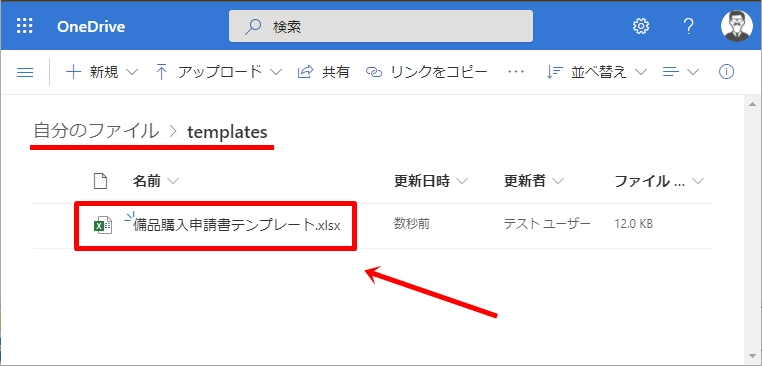

このテンプレートファイルは下記のように[名前付きセル範囲](https://docs.microsoft.com/ja-jp/office/vba/excel/concepts/cells-and-ranges/refer-to-named-ranges?WT.mc_id=M365-MVP-4029057)やテーブルが設定してあります。

- シート名：備品購入申請書
- セルF1：日付
- セルF4：氏名
- セルG4：印
- セルB7 ～ F11：入力欄(テーブル)

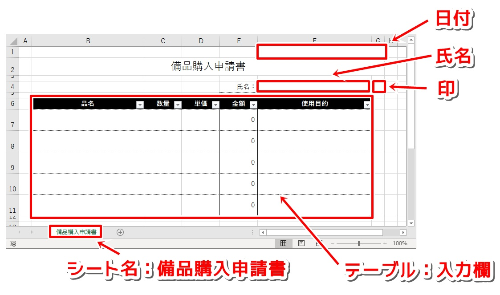

## ハンコ用画像の準備

次はハンコ用の画像を準備します。  
「[inkan.png](files/inkan.png)」ファイルをダウンロードし、任意のOneDrive上のフォルダにアップロードします。  
(ここでは **/images/inkan.png** ファイル)

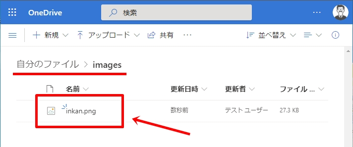

ハンコ用の画像は「[印鑑透過](https://tojikomorin.sakura.ne.jp/inkan/)」から作成することもできます。

## スクリプトの作成

次は実行するスクリプトを準備します。  
コードエディターに下記コードを貼り付け、「**備品購入申請書作成**」として保存します。

```typescript:備品購入申請書作成.ts
function main(
    workbook: ExcelScript.Workbook,
    氏名: string,
    日付: string,
    品名: string,
    単価: number,
    数量: number,
    使用目的: string,
    印: string
) {
    let shtMain = workbook.getWorksheet("備品購入申請書");
    let rngName = shtMain.getRange("氏名");
    let rngDate = shtMain.getRange("日付");
    let rngStamp = shtMain.getRange("印");
    let tblMain = shtMain.getTable("入力欄");

    rngName.setValue(氏名);
    rngDate.setValue(日付);
    let imgStamp = shtMain.addImage(印);
    imgStamp.setHeight(18);
    imgStamp.setWidth(18);
    imgStamp.setTop(rngStamp.getTop());
    imgStamp.setLeft(rngStamp.getLeft());
    let rngRow1 = tblMain.getRangeBetweenHeaderAndTotal().getRow(0);
    rngRow1.setValues([[品名, 数量, 単価, , 使用目的]]);
}
```
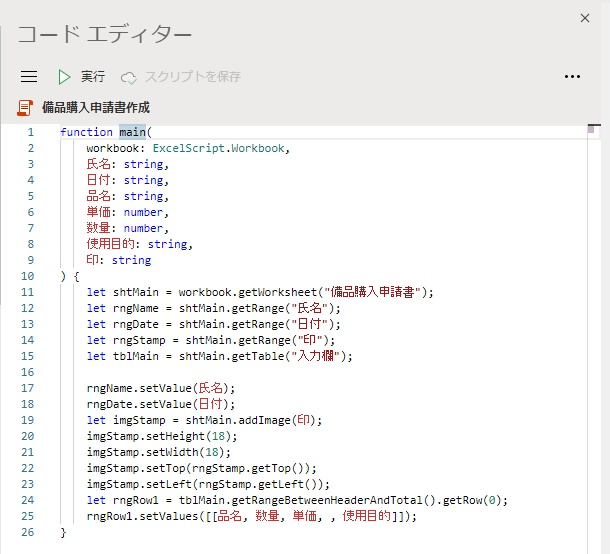

## フローの作成

次はPower Automateでフローを作成します。

1. Power Automateを開きます。

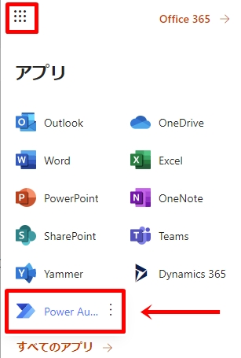

2. 「作成」から「**インスタント フロー**」をクリックします。

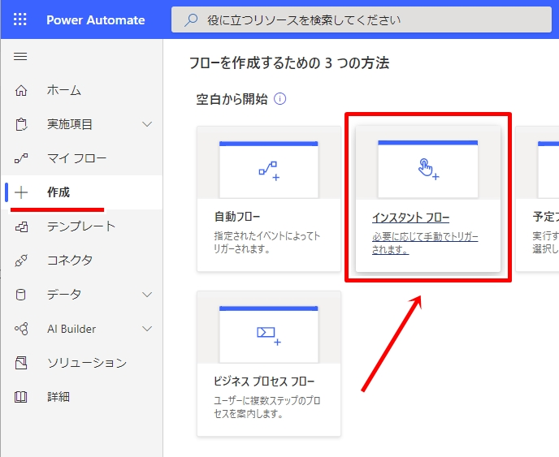

3. フロー名を入力後、「**手動でフローをトリガーします**」を選択し、「**作成**」ボタンをクリックします。

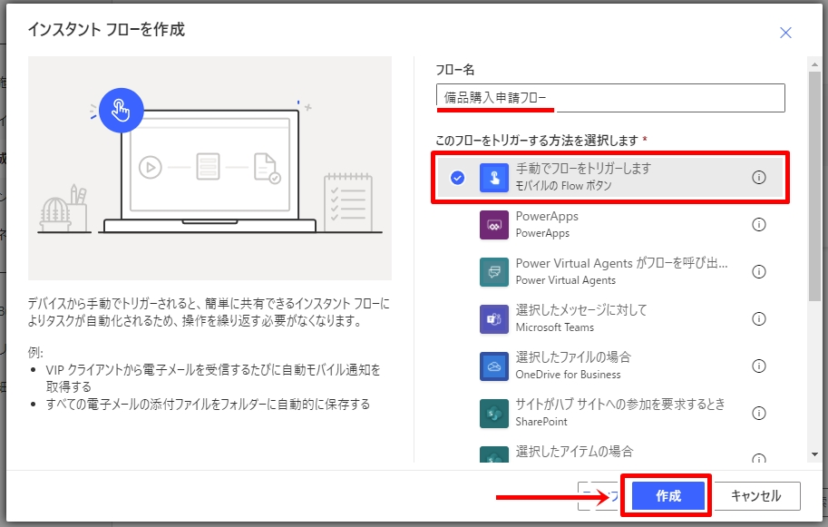

4. 「新しいステップ」から「**タイム ゾーンの変換**」を選択します。

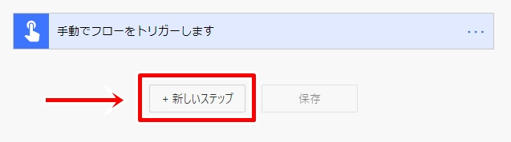

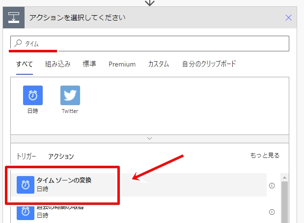

5. 「基準時間」は「**タイムスタンプ**」、「変換元のタイムゾーン」は「**(UTC) 協定世界時**」、「変換先のタイムゾーン」は「**(UTC+09:00) 大阪、札幌、東京**」、「書式設定文字列」は「**短い形式の日付パターン**」を選択します。

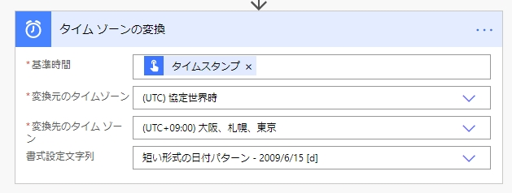

6. 「新しいステップ」から「**パスによるファイル コンテンツの取得**」を追加します。

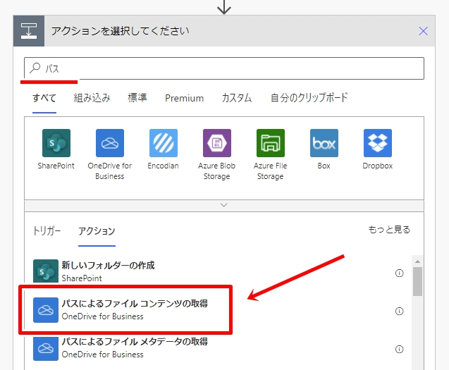

7. 「ファイル パス」として、ハンコ用画像のパスを指定します。

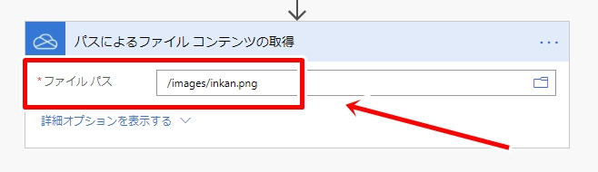

8. 「新しいステップ」から「**作成**」を追加します。

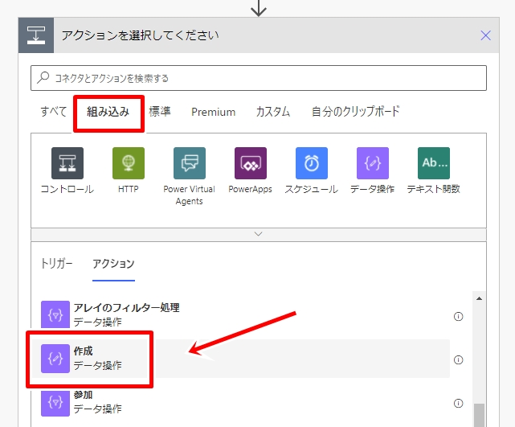

9. 「入力」として、下記式を入力します。

```
@{base64(body('パスによるファイル_コンテンツの取得'))}
```

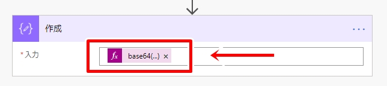

10. 「新しいステップ」から「**パスを使用したファイルのコピー**」を追加します。

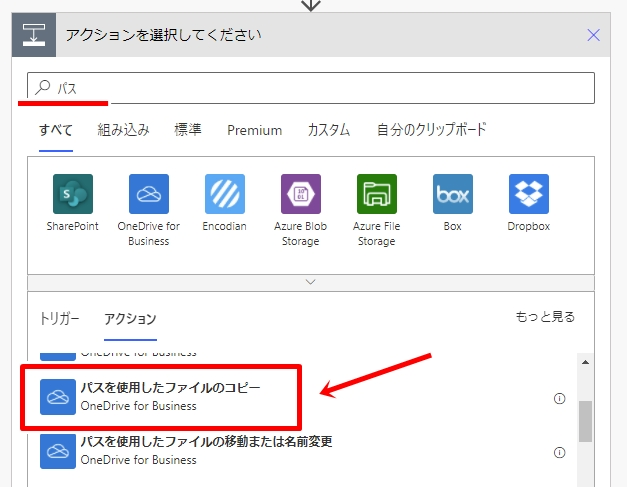

11. 「ファイル パス」は**備品購入申請書テンプレートのパス**、「対象ファイルのパス」は任意(ここでは **/申請書/備品購入申請書.xlsx** を指定)、「上書きする」は「**はい**」を選択します。

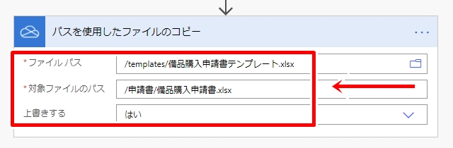

12. 「新しいステップ」から「**スクリプトの実行**」を追加します。

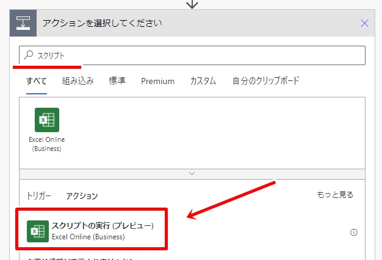

13. 「場所」は「**OneDrive for Business**」、「ドキュメント ライブラリ」は「**OneDrive**」、ファイルは「**ファイル ロケーター**」、「スクリプト」は「**備品購入申請書作成**」を選択します。

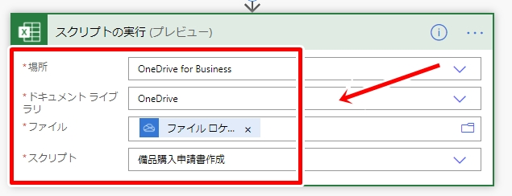

14. スクリプトに渡すパラメーターが設定できるようになるので、「氏名」、「品名」、「単価」、「数量」、「使用目的」を入力します。「日付」は「変換後の時間」、「印」は「出力」を指定します。

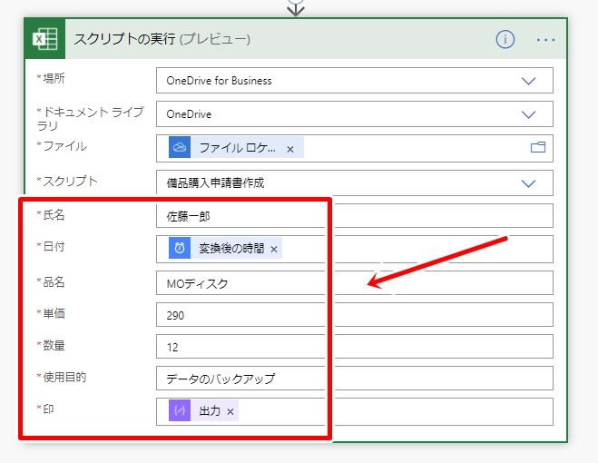

15. フローを保存し、「**テスト**」ボタンをクリックして動作確認を行います。

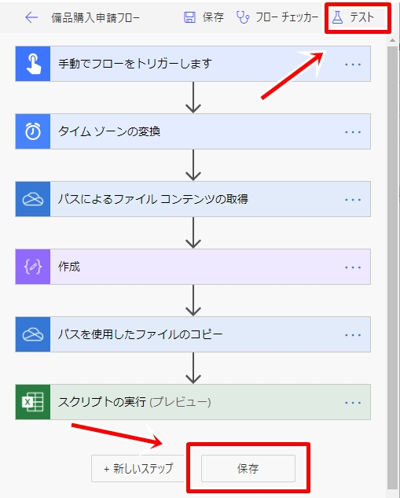

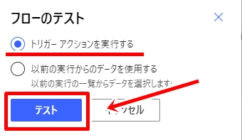


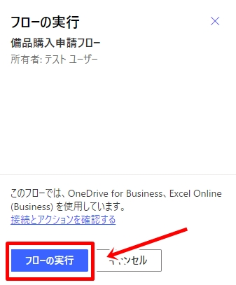

16. 「**フローの実行ページ**」を開き、問題無く動作したかどうかを確認します。

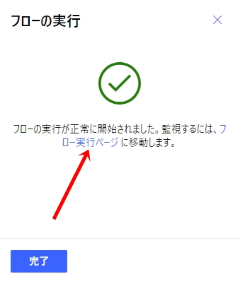

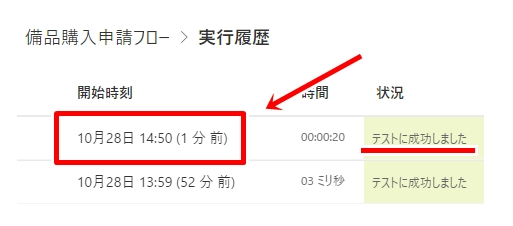

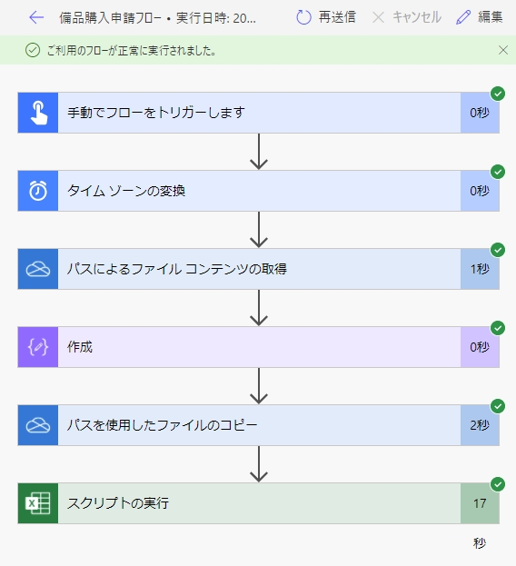

17. 問題無くフローが実行されていれば、手順11.で指定したフォルダにExcelファイルが保存されているはずなので、開いて内容を確認します。

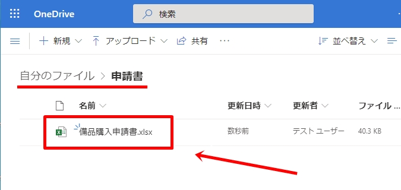

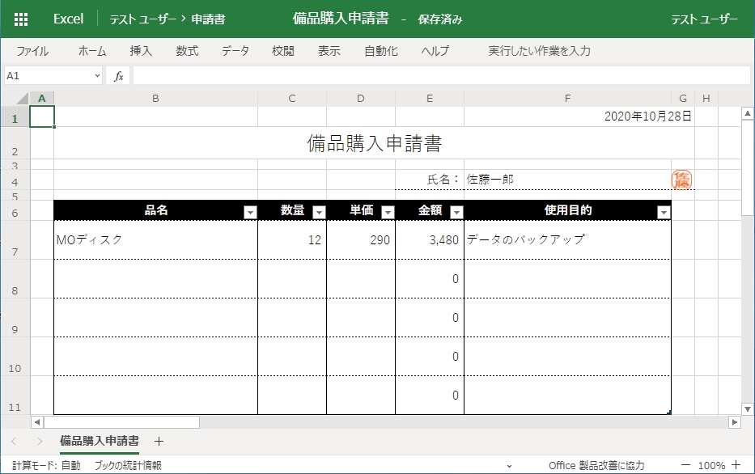

以上で、Office Scriptsを使って備品購入申請書を作成するフローの作成作業は終了です。

## フロー全体図

フローの全体図は下図の通りです。

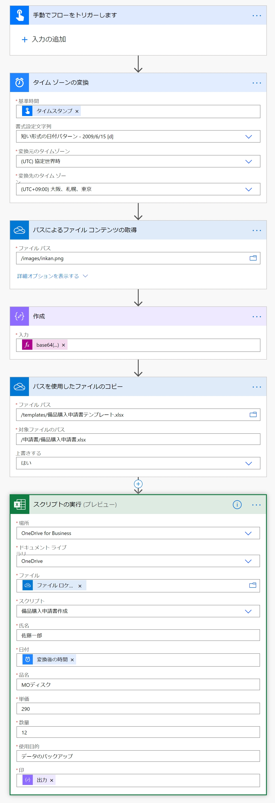

## 追加課題・お辞儀ハンコ

余裕がある方は、追加課題として、ハンコの画像をお辞儀させてみましょう！

ヒント：標準図形オブジェクト(Shape)は「[setRotation](https://docs.microsoft.com/ja-jp/javascript/api/office-scripts/excelscript/excelscript.shape?WT.mc_id=M365-MVP-4029057#setrotation-rotation-)」メソッドによって回転角度を指定できます。

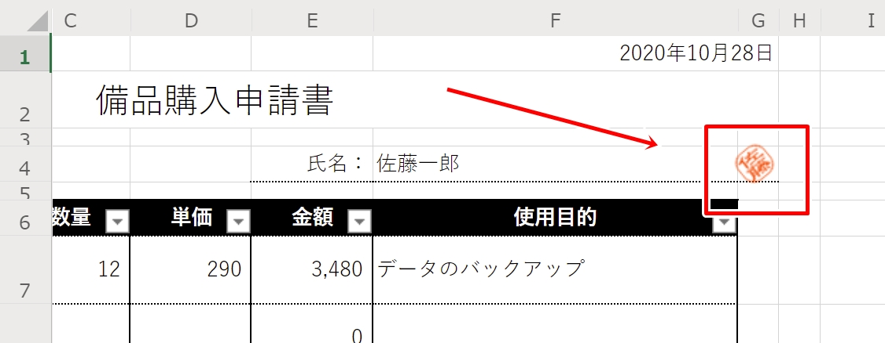

コード例：[GitHub Gist](https://gist.github.com/kinuasa/b9a9af2403e54116e87d63e60c7827bd)