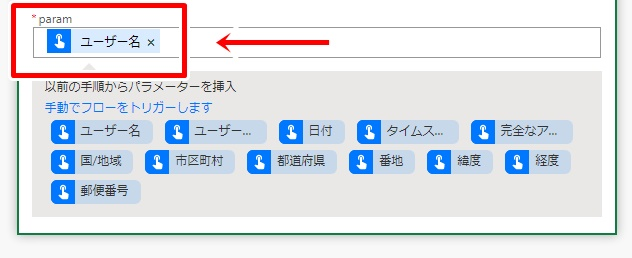
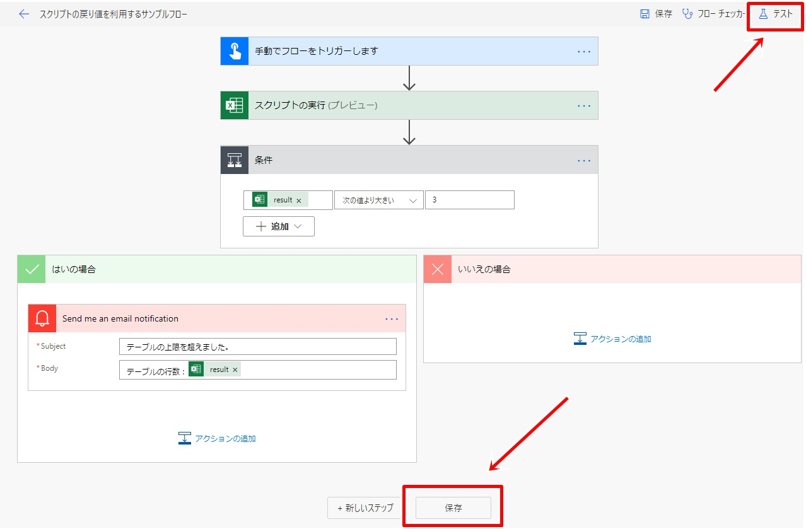

# スクリプトの戻り値を利用するフローのサンプル

- [テーブルを作成するスクリプト](#テーブルを作成するスクリプト)
- [Power Automateから実行するスクリプト](#Power-Automateから実行するスクリプト)
- [フローの作成](#フローの作成)
- [フロー全体図](#フロー全体図)

---

スクリプトからの戻り値を利用する、Power Automateフローの簡単なサンプルです。

## テーブルを作成するスクリプト

まずは使用するシートとテーブルを準備します。  
新規Excelファイルを作成し、下記スクリプトを実行します。

下記スクリプトは、最初のシート名を「**サンプルシート**」とし、セルA1を「**サンプルテーブル**」とするスクリプトです。

```typescript:テーブル作成.ts
function main(workbook: ExcelScript.Workbook) {
  let sheet = workbook.getFirstWorksheet();
  sheet.setName("サンプルシート");
  let range = sheet.getRange("A1");
  range.setValue("サンプル列");
  workbook.addTable(range, true).setName("サンプルテーブル");
}
```

上記スクリプト実行後、「**テーブルに行追加.xlsx**」ファイルとして保存します。


## Power Automateから実行するスクリプト

次はフローから呼び出すスクリプトを準備します。  
「**テーブルに行追加.xlsx**」ファイルを開き、下記スクリプトを「**テーブルの行数取得**」として保存します。

```typescript:テーブルの行数取得.ts
function main(workbook: ExcelScript.Workbook, param: string = "Hello.") {
  let sheet = workbook.getWorksheet("サンプルシート");
  let table = sheet.getTable("サンプルテーブル");
  table.addRow(-1, [param]);
  return table.getRangeBetweenHeaderAndTotal().getRowCount(); //見出し行以外の行数取得
}
```

上記スクリプトは、「**サンプルシート**」上の「**サンプルテーブル**」に行を追加し、見出し行以外の行数を返すスクリプトです。


## フローの作成

次はPower Automateでフローを作成します。

1. Power Automateを開きます。


2. 「作成」から「**インスタント フロー**」をクリックします。


3. フロー名を入力後、「**手動でフローをトリガーします**」を選択し、「**作成**」ボタンをクリックします。


4. 「新しいステップ」から「**スクリプトの実行**」を選択します。


5. 「場所」は「**OneDrive for Business**」、「ドキュメント ライブラリ」は「**OneDrive**」、ファイルは「**テーブルに行追加.xlsx**」、「スクリプト」は「**テーブルの行数取得**」を選択します。


6. スクリプトに渡すパラメーターが設定できるようになるので、「param」として適当な値を指定します(今回は「ユーザー名」)。



7. 「新しいステップ」から「**条件**」を選択します。


8. 条件を「**result**」「**次の値より大きい**」「**3**」とします。


9. 「はいの場合」から「**アクションの追加**」をクリックします。


10. 「**Send me an email notification**」を選択し、「Subject」は「**テーブルの上限を超えました。**」、「Body」は「**テーブルの行数：result**」を指定します。


11. フローを保存し、「**テスト**」ボタンをクリックして動作確認を行います。




12. 「**フローの実行ページ**」を開き、問題無く動作したかどうかを確認します。


13. 問題無くフローが実行されていれば、手順5.で指定したExcelファイルのテーブルに行が追加されていることが確認できます。


14. 数回フローを実行し、手順8.で指定した行数を超えた時点で通知メールが送信されることを確認します。


以上のように、スクリプトからの戻り値を活用することで、フローを分岐させることができます。

## フロー全体図

フローの全体図は下図の通りです。

