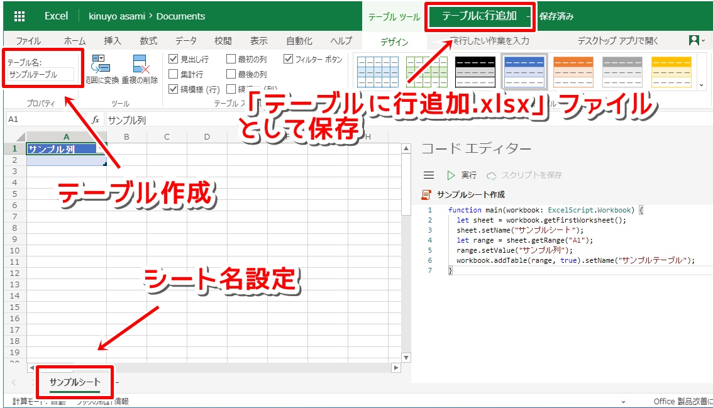

# スクリプトの戻り値を利用するフローのサンプル

- [テーブルを作成するスクリプト](#テーブルを作成するスクリプト)
- [Power Automateから実行するスクリプト](#Power-Automateから実行するスクリプト)
- [フローの作成](#フローの作成)

---

スクリプトからの戻り値を利用する、Power Automateフローの簡単なサンプルです。

## テーブルを作成するスクリプト

まずは使用するシートとテーブルを準備します。  
新規Excelファイルを作成し、下記スクリプトを実行します。

下記スクリプトは、最初のシート名を「**サンプルシート**」とし、セルA1を「**サンプルテーブル**」とするスクリプトです。

```typescript:テーブル作成.ts
function main(workbook: ExcelScript.Workbook) {
  let sheet = workbook.getFirstWorksheet();
  sheet.setName("サンプルシート");
  let range = sheet.getRange("A1");
  range.setValue("サンプル列");
  workbook.addTable(range, true).setName("サンプルテーブル");
}
```

上記スクリプト実行後、「**テーブルに行追加.xlsx**」ファイルとして保存します。

## Power Automateから実行するスクリプト

次はフローから呼び出すスクリプトを準備します。  
「**テーブルに行追加.xlsx**」ファイルを開き、下記スクリプトを「**テーブルの行数取得**」として保存します。

下記スクリプトは、「**サンプルテーブル**」に行を追加し、見出し行以外の行数を返すスクリプトです。

```typescript:テーブルの行数取得.ts
function main(workbook: ExcelScript.Workbook, param: string = "Hello.") {
  let sheet = workbook.getWorksheet("サンプルシート");
  let table = sheet.getTable("サンプルテーブル");
  table.addRow(-1, [param]);
  return table.getRangeBetweenHeaderAndTotal().getRowCount(); //見出し行以外の行数取得
}
```
## フローの作成

下図のようなフローを作成し、スクリプトからの戻り値によって条件判定されることを確認します。

