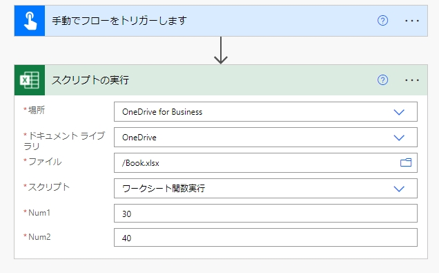
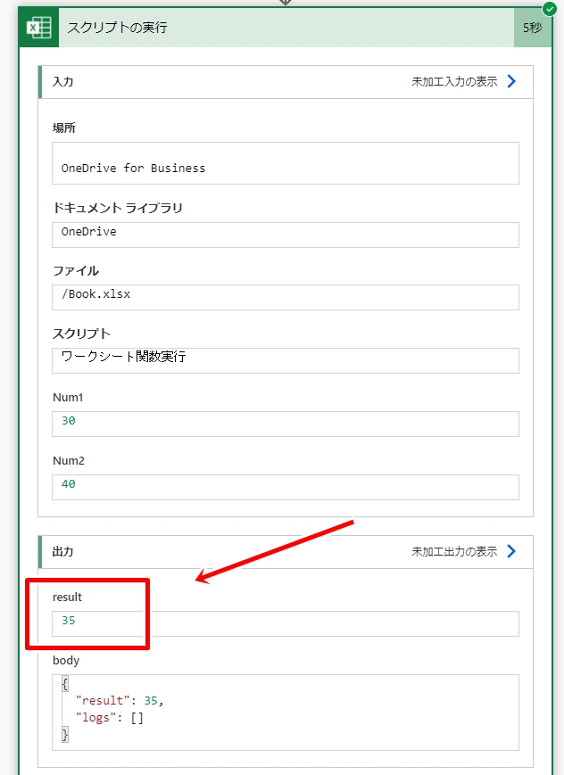

# フローからスクリプト経由でワークシート関数を実行する方法

処理対象となる新規Excelファイルと実行する下記スクリプト(テーブルに行追加)を作成します。  
下記スクリプトは2つの数値を指定して[AVERAGE](https://support.microsoft.com/ja-jp/office/047bac88-d466-426c-a32b-8f33eb960cf6?WT.mc_id=M365-MVP-4029057)関数を使って平均値を取得するスクリプトです。  

```typescript:ワークシート関数実行.ts
function main(workbook: ExcelScript.Workbook, Num1: number, Num2: number): number
{
  const sheet = workbook.getFirstWorksheet();
  const range = sheet.getRange("A1:A3");
  range.setNumberFormat("General"); //表示形式を標準に設定
  range.setValues([[Num1], [Num2], ["=AVERAGE(A1:A2)"]]);
  return Number(range.getCell(2, 0).getValue());
}
```

「スクリプトの実行」アクションで上記スクリプトを実行すると、下図のように関数の結果を取得できることが確認できます。  



